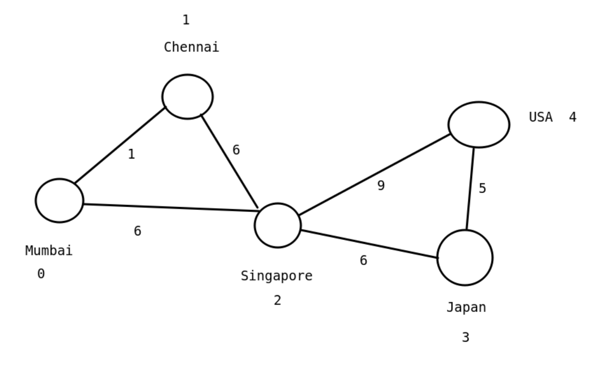
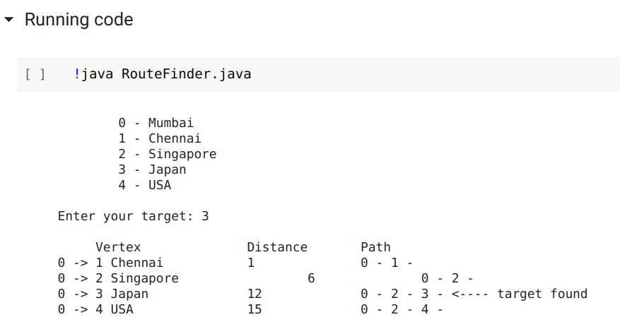
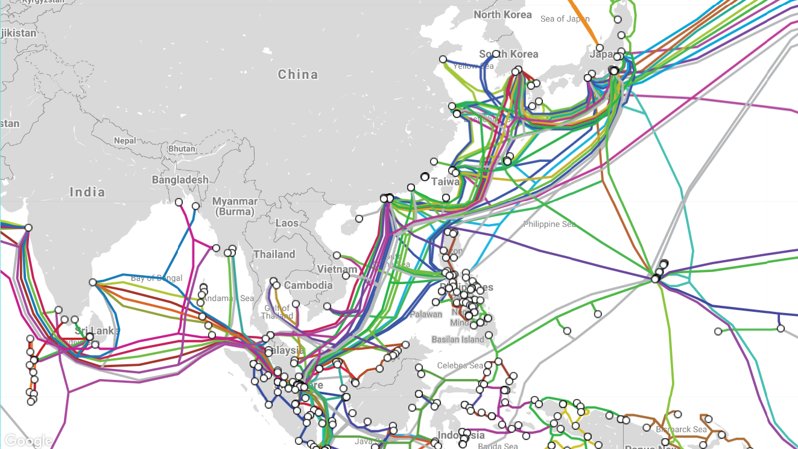

# Submarine_cable_route

Finds the best path to send the data through submarine cables.

[Notebook Link 1](https://colab.research.google.com/drive/1_wxNXhrEABJHf5x_nxoCpvqg2pCBR6YX?usp=sharing)
&nbsp;
[Link 2](https://colab.research.google.com/github/vh-praneeth/Submarine_cable_route/blob/master/Notebook.ipynb)
&nbsp;
[Worldwide cable map](https://www.submarinecablemap.com/)

### <ins> Title</ins>: Submarine cable route planner
### <ins> Group</ins>: G7

### Report
##### <ins> Graph visualization</ins>: 

##### <ins> Output</ins>: 

#### <ins> Objectives</ins>: 
  To help the networking companies manage the routes in an efficient way to save the operating costs, and send data in a minimal amount of time.

#### <ins> Methodology</ins>: 
  Map data is entered into text files. We use <ins> Dijkstra's algorithm</ins> to find the route.
The algorithm finds the shortest path between the mentioned source and destination which is entered by the user.

Code is uploaded to GitHub repository: https://github.com/vh-praneeth/Submarine_cable_route

#### <ins> Map screenshot</ins>: 

&nbsp;

### Other parts from Project Proposal document

#### <ins> Abstract</ins>: 
  * We need to send data from our computer to a different server using the internet. It is sent to different countries through Submarine cables which are installed in the sea. The cables route about 99% of global internet traffic. These cables are also called Undersea cables.
  * There are many possible paths using which we can send data. Each cable has a different capacity and different amount of other traffic which is currently being sent.

#### <ins> Expected Outcome</ins>: 
  Using this project, we write an algorithm that finds the best path to send the data to the destination, with the minimum distance possible.
