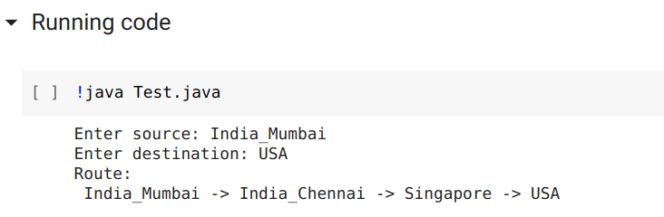

# Submarine_cable_route

Finds the best path to send the data through submarine cables.

[Notebook Link 1](https://colab.research.google.com/drive/1_wxNXhrEABJHf5x_nxoCpvqg2pCBR6YX?usp=sharing)

[Link 2](https://colab.research.google.com/github/vh-praneeth/Submarine_cable_route/blob/master/Notebook.ipynb)

[Worldwide cable map](https://www.submarinecablemap.com/)

### <ins> Title</ins>: Submarine cable route planner

### <ins> Group</ins>: G7

### <ins> Implementation </ins>:
We enter map data in text files. The algorithm finds the path.
The algorithm finds the shortest path between the mentioned source and destination.
Code is uploaded to GitHub repository:
https://github.com/vh-praneeth/Submarine_cable_route

#### <ins> Sample Output</ins>: 

#### <ins> Abstract</ins>: 
  * We need to send data from our computer to a different server using the internet. It is sent to different countries through Submarine cables which are installed in the sea. The cables route about 99% of global internet traffic. These cables are also called Undersea cables.
  * There are many possible paths using which we can send data. Each cable has a different capacity and different amount of other traffic which is currently being sent.

#### <ins> Methodology</ins>: 
  We use a programming language to write code. We will use text files to input the cable capacity, location, and traffic data. We will implement a routing algorithm.

#### <ins> Expected Outcome</ins>: 
  Using this project, we write an algorithm that finds the best path to send the data to the destination, with the minimum distance possible.
